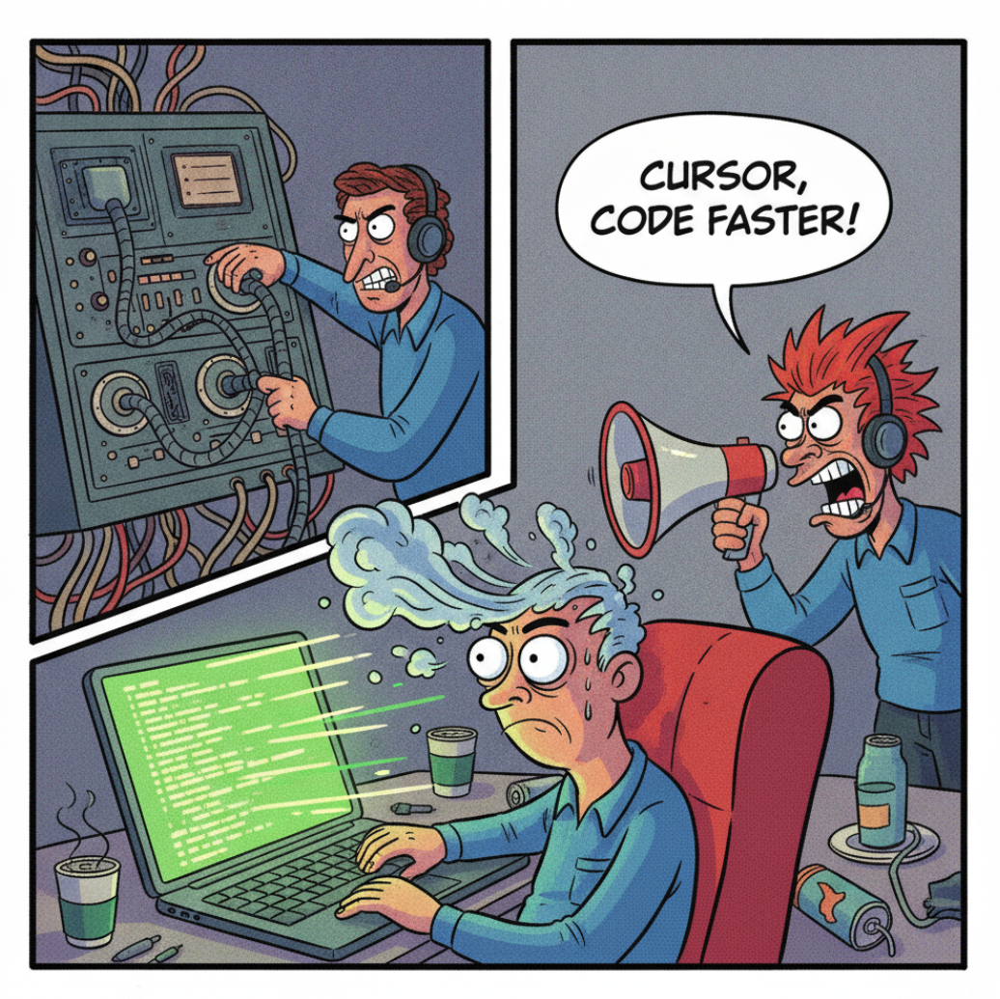
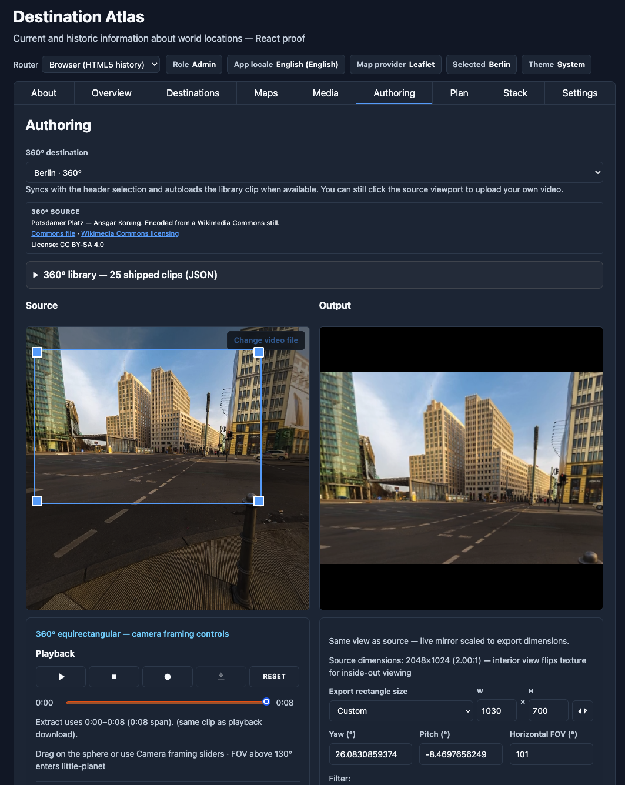

# RosettaDash: Why I Built a Dashboard Factory in the Agentic Era

*How I used Cursor and several AI models to build cross-framework
dashboard components — React, Vue, Angular, Svelte, and custom
elements — without rewriting the same screen five times.*



## The problem I kept hitting

Over the past decade, I have written components over and over again in multiple frameworks. React one day. Angular the next. Svelte because a team member insists. AI autocomplete has made development easier; one stack at a time. It does not, however, give you the front-end equivalent to **Haxe**, the high-level language that compiles to Java, C#, Python, or even JavaScript. There
is still no “write once, run in any framework” library.

## Introducing RosettaDash

RosettaDash is a **component factory**, not a hosted dashboard SaaS. You drag components onto a canvas, bind them (date range to table to chart, and so on), preview with mock or actual data, and export. In addition to standard dashboard components, new features include **bring-your-own-key (BYOK)**; **WASM**; video editing using JavaScript; and many other easter eggs.

As the cost of AI impacts all of us, BYOK is an early consideration for developers today. We use BYOK without thinking of it when we switch devices. Through your Netflix or Amazon key access, your phone or your television can view the same content. The use case for BYOK is obvious if you are developing an app that has an AI component in it. Developers should not go broke due to their app's popularity.

## Destination Atlas: Built from RosettaDash

**Destination Atlas** is the proof that the components work together coherently as a group. It is a travel-explorer app — thirty cities, maps, a globe, YouTube media, roles, API keys, and much more. Five **proof apps** run the same screens in five runtimes. Among its easter eggs, a video-editing app using **ffmepg running in wasm** and a client-side JavaScript editor.



RosettaDash, itself, is a proof of concept more than a replacement for how you currently work. It provides a higher view of component development that reveals the commonality across framework libraries. Ultimately, each framework is doing roughly the same as the next. The components generated with RosettaDash are quite fast-performing in all of the frameworks tested.

To begin and try it yourself:

```bash
git clone https://github.com/KevinEverywhere/rosettadash.git
cd rosettadash
npm install
npm start
```

Open <http://localhost:4200>, pick a framework, compose something small,
export it, and open the zip in Cursor.

Or run a proof app, Destination Atlas in one of the frameworks:

```bash
npm run proof:react
```

Or, view the components in Storybook:

```bash
npm run storybook:angular
```

Or, merely view a demo:

```bash
npm run demo:weather
```

Or prove exported server and database code against Docker:

```bash
npm run parity:db:up && npm run start:server   # second terminal for generate/up
npm run parity:generate && npm run parity:servers:up
npm run proof:react   # Stack tab → live seeded orders when parity is up
```

<!-- D-AS-188 SUGGESTED: Optional fourth path (Kevin — promote if you want it)
Or prove exported server and database code against Docker:

```bash
npm run parity:db:up && npm run start:server   # second terminal for generate/up
npm run parity:generate && npm run parity:servers:up
npm run proof:react   # Stack tab → live seeded orders when parity is up
```

Four databases seed in Docker; generated Nest, Express, Next, and Nuxt apps
serve the same `orders` rows on ports 53101–53104.
-->

## Next

The articles are short, and each has a different focus.

| # | Article | One line |
| --- | --------- | ---------- |
| 01 | [Components that Travel](../01-components-that-travel/) | What “travel” means — export to React, Vue, Angular, Svelte, or custom elements; four ways into the project |
| 02 | [The Builder](../02-the-builder/) | Palette, canvas, inspector, preview, and export — where you compose |
| 03 | [Storybook](../03-storybook/) | One component at a time; five catalogs on ports 6006–6010 |
| 04 | [Destination Atlas](../04-destination-atlas/) | The demo as a product — workbench, About, Overview, Destinations, thirty-city library |
| 05 | [Maps, Globes, Media, and WASM](../05-maps-globes-media-wasm/) | 2D map providers, the globe, YouTube, ffmpeg, wasm, and image data in the browser |
| 06 | [Settings, BYOK, Roles, i18n, Stack](../06-settings-byok-roles-i18n-stack/) | API keys in the browser, app locale, role gates, and invisible infra |
| 07 | [One Canvas, Five Runtimes](../07-one-canvas-five-runtimes/) | Five proof apps, native and mixed |
