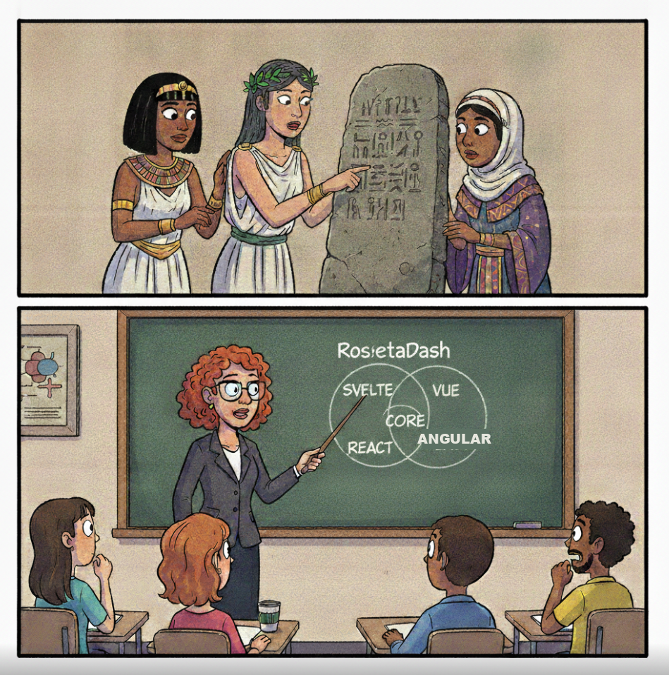
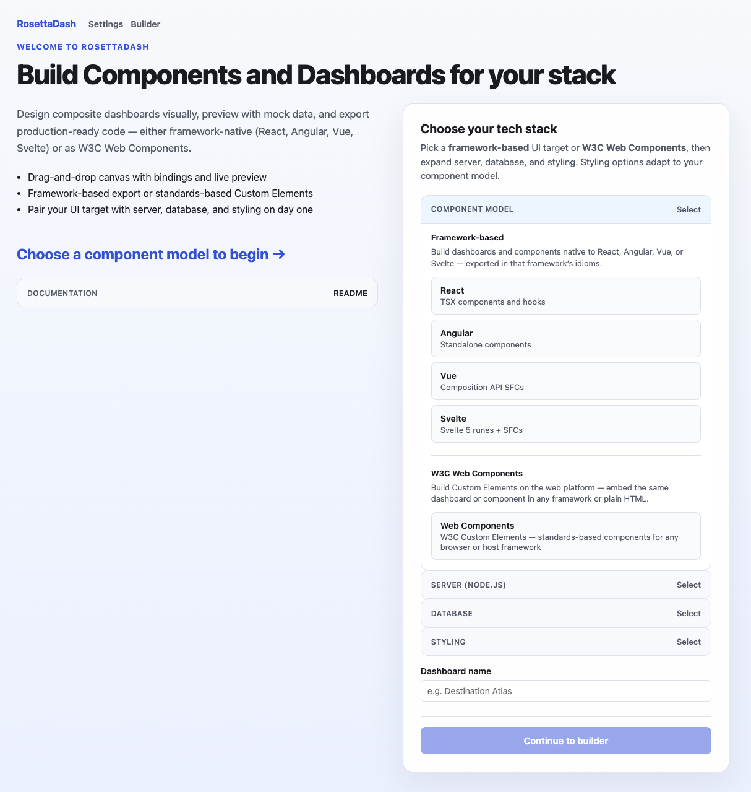
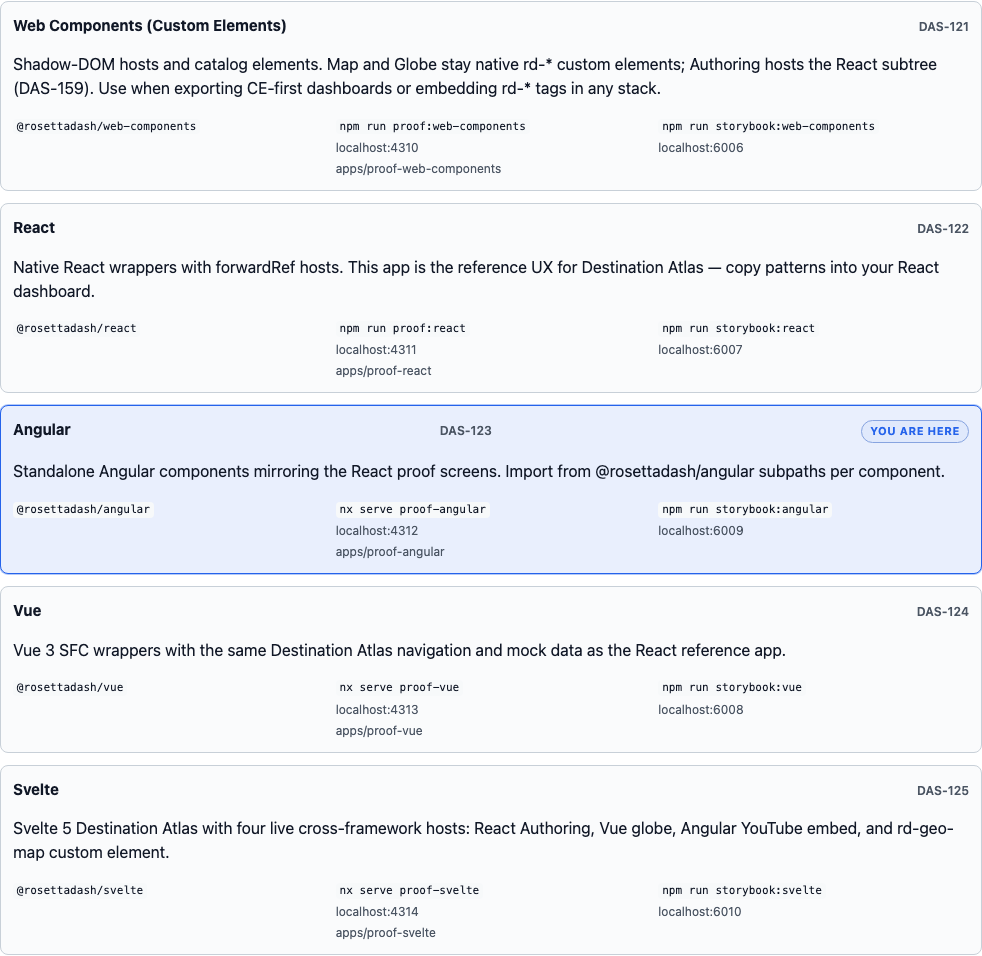
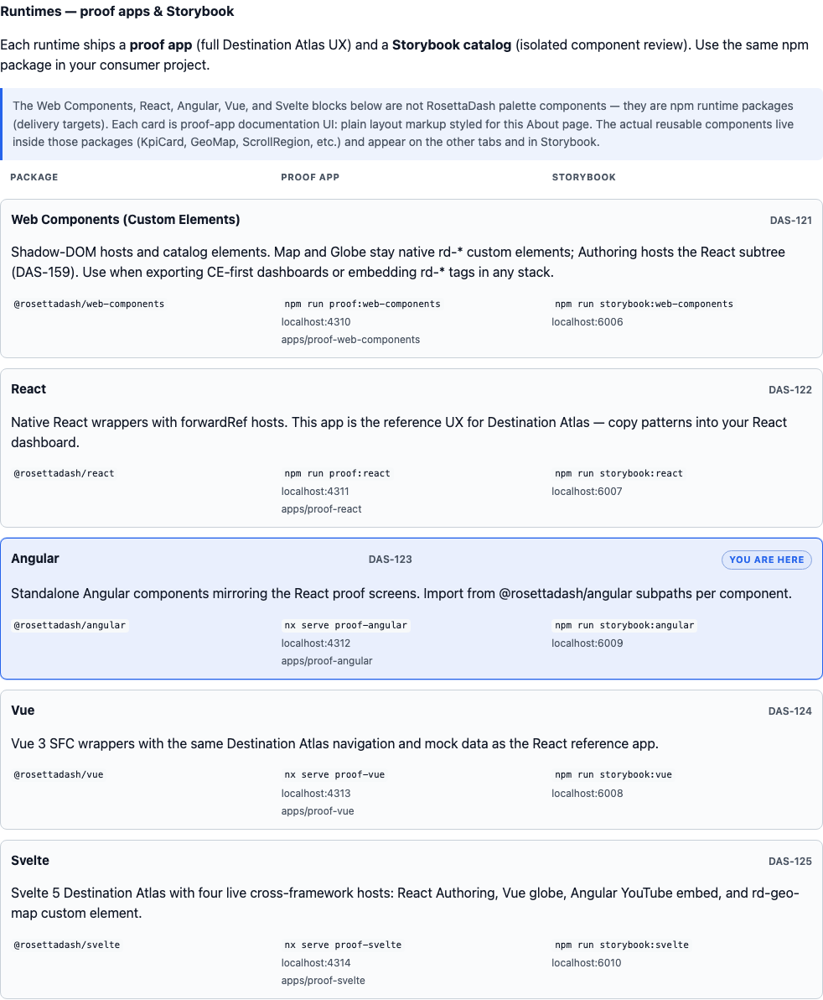
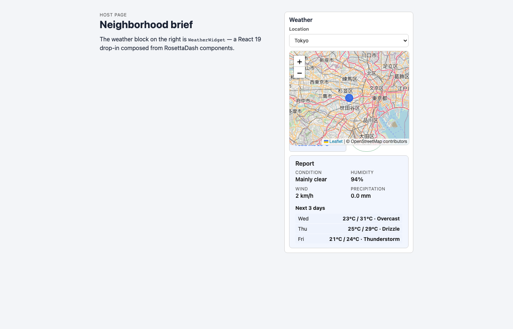

# RosettaDash: Components that Travel

RosettaDash is a portmanteau of Rosetta, the Egyptian stone with Demotic, Greek, and hieroglyphic characters that enabled modern translation of extinct languages, and the modern web dashboard. The motivation behind it is to enable component creation that can be used for whichever framework you choose.

These days, when AI helps us author our code, we are still forced to think in the context of one framework at a time. There is no front-end equivalent to Haxe, a high-level language that compiles to Java, C#, Python, and even JavaScript. In that spirit, this project provides developers a single source of truth for their cross-framework component requirements.

RosettaDash runs locally as a component factory. You compose on a canvas and export real source files. The default zip is standalone: drop it into a project, set environment variables, and run. More often, you install only the npm modules you need — the full authoring environment with the builder, or a framework-specific library together with the shared cross-framework core.

## What “travel” means

A RosettaDash component can have a type, properties, ports, and events, and it can target whichever framework(s) that you need. The same definition can be exported as React, Angular, Vue, Svelte, or a W3C custom element. Server and database partners are available if you need them (Next, Nuxt, Nest, Express; Mongo, Postgres, Supabase, MySQL). You can also simply export the UI component and integrate it with an existing codebase.

All four server frameworks and four databases are not just export
targets. Clone the repo and you can prove exports against real engines
in Docker: `npm run parity:db:up`, then `parity:generate` and
`parity:servers:up`. `npm run parity:check` confirms each generated
server returns the same seeded rows. Idiomatic pairings: React→Next,
Angular→Nest, Vue→Nuxt, Svelte→Express. Article 6 walks through the
live Stack demo.

<!-- D AS-188 SUGGESTED: replace paragraph above (local proof)
All four server frameworks and four databases are not just export
targets. Clone the repo and you can prove exports against real engines
in Docker: `npm run parity:db:up`, then `parity:generate` and
`parity:servers:up`. `npm run parity:check` confirms each generated
server returns the same seeded rows. Idiomatic pairings: React→Next,
Angular→Nest, Vue→Nuxt, Svelte→Express. Article 6 walks through the
live Stack demo.
-->

<!-- D AS-188 SUGGESTED: Local proof of server/database exports
Clone the repo and, from its root, you can prove exports against real
databases in Docker: `parity:db:up`, then `parity:generate` and
`parity:servers:up`. `parity:check` confirms each generated server returns
the same seeded rows. Idiomatic pairings: React→Next, Angular→Nest,
Vue→Nuxt, Svelte→Express.
-->

## Four ways in

There are four entry points into the project, and this series walks through them in order.

**The builder** is the main authoring surface, for developers who want to get close to the code. Run `npm start`, open localhost:4200, pick a stack, compose, preview, and export. The next article covers it in detail.

**Storybook** is available for each framework, on ports 6006 through 6010. You may just need to see how a single piece works, how it is affected by parameter changes. Storybook can be a real time-saver. This is reviewed in article 3.

**Destination Atlas** is a single app built to show every component working together. The five proof apps share one dataset, and the app is discussed in articles 4 through 6.

**npm** is used to provide developers a simple way to include prebuilt components for individual frameworks: `@rosettadash/core` plus `@rosettadash/react`, `angular`, `vue`, `svelte`, or `web-components`. Use it when you want to import a typed component into an app you already have.

Eleven page-embed widget demos ship with the repo — a React weather
card, a Vue flight board, an Angular stock ticker, a Svelte transit
list, a custom-element 360° tour, and others. They use the same
components as the builder, without the Destination Atlas shell or the
builder canvas. To preview one on a host page before opening a proof
app, `npm run demo:weather` on port 4320 is enough. Run
`npm run demo:weather` through `demo:listing` from package.json for
the full set.

<!-- D AS-188 SUGGESTED: replace demos paragraph above
Eleven page-embed widget demos ship with the repo — a React weather
card, a Vue flight board, an Angular stock ticker, a Svelte transit
list, a custom-element 360° tour, and others. They use the same
components as the builder, without the Destination Atlas shell or the
builder canvas. To preview one on a host page before opening a proof
app, `npm run demo:weather` on port 4320 is enough. Run
`npm run demo:weather` through `demo:listing` from package.json for
the full set.
-->

RosettaDash is aimed at teams that ship production software — full-stack developers, frontend specialists who need exports that match their repo conventions, and agencies working across more than one client stack.

## Next

The next article covers the builder: palette, canvas, inspector, templates, preview, and export.
