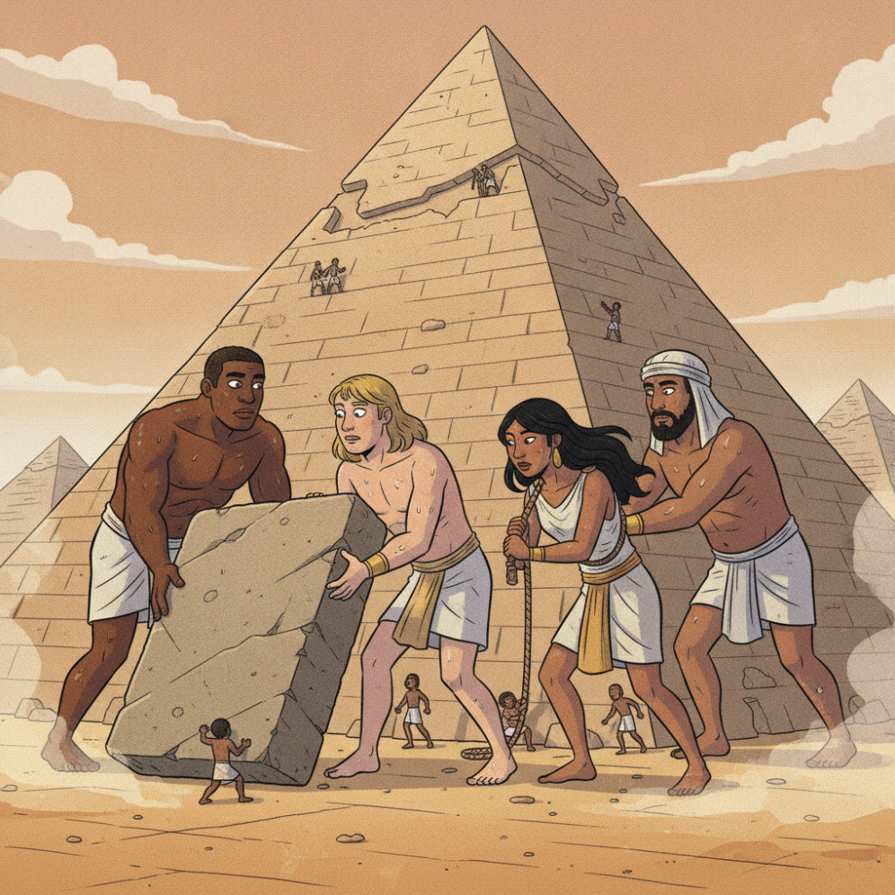
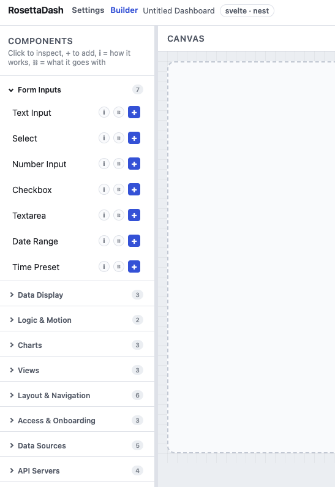
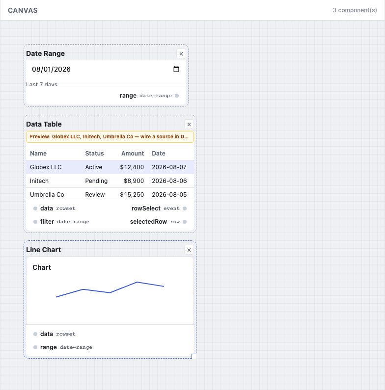
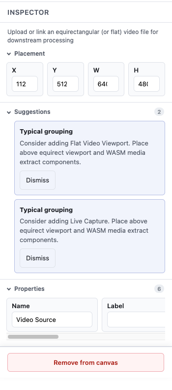
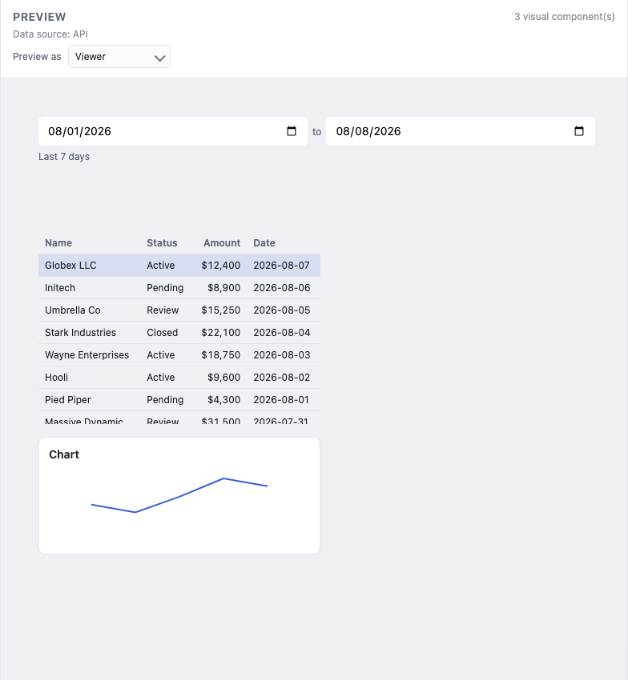
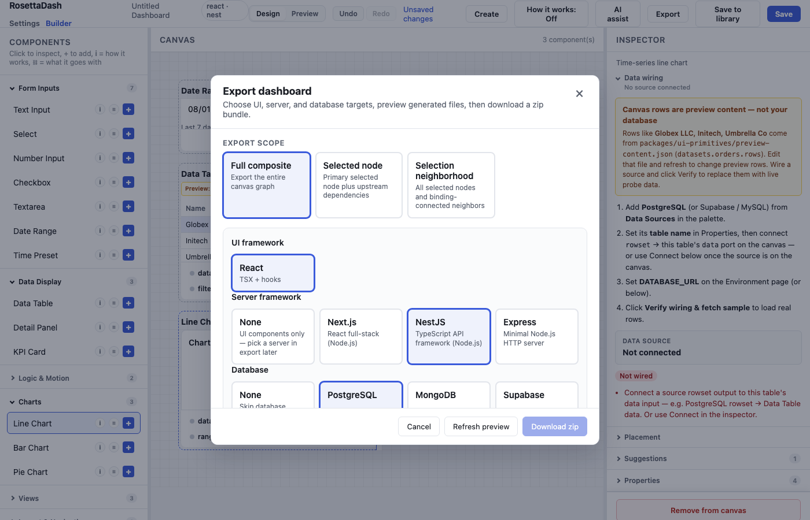

# The Builder: The Dashboard Component Factory



RosettaDash’s builder is an Angular client using a NestJS API, both local. From the repo root:

```bash
npm install
npm start
```

Open <http://localhost:4200>, where the angular app runs; the NestJS app is running on <http://localhost:3000>. You need both processes, which launch together. Save, preview, and export talk to the API. This is probably the geekiest article in the series.

## Getting Started

You select a front end framework, which determines future choices of servers, database, and styling suggestions. Certain libraries and applications favor or are only available to specific frameworks, such as Nuxt, mui, and others. The secondary selections change when you change base framework.

After you have selected Web Components, React, Angular, Vue, or Svelte, choose the mix of server and database (if any) along with how you will style the components, then press Continue to builder.

If you have a small screen, you will immediately see an alert saying that you need a screen width of 1024 pixel or greater. Truthfully, the builder is more suited for large desktop screens, at least 1280 or more pixels.

## Becoming Familiar with the Interface

The sections of the interface are: the components are grouped on the left side of the screen in a palette. Next is the canvas, where components are placed by selecting the + button on their component. Once on the canvas, their details are available in the Inspector panel on the right. At the top of the screen, choices like design and preview, undo and redo, create, how it works, AI assist and export, and save and save to library provide the ways to see and work with the components, and how to create, export and save the components that you have created.



**Components.** On the left side, the components are arranged in groups. You will recognize many: a KPI (key performance indicator), a table, a date range, a grid, a chart, and many others. Clicking the components header collapses it to the left side.

**Canvas.** In the center of the app, you can place, snap, resize, and multi-select in the canvas. The canvas is for the positioning and sizing of the component elements for your exported component.



**Inspector.** On the right side, the Inspector is activated when something is selected on the canvas. Properties, suggestions, data sources and other details are visible here.



**Preview.**
<!-- Switch to Preview. Mock data comes from the local API. Click the filter. Watch the table. -->

<!-- <!-- D AS-188 SUGGESTED: Preview vs parity (after Preview paragraph) -->
Preview mock data comes from the builder API on `:3000` — the same
`preview-content.json` rows the canvas describes. That is not the same as
proving **your** Welcome stack in Docker (see Nodes that never render below):
parity boots the **database profile** and **server profile** that match what
you picked on Welcome, not every engine at once.
<!-- -->



**Export.** Full composite, a single node, or a selection neighborhood (the pieces you highlighted plus what they need). Download source. For a UI-only stack you get templates, styles, and scripts.



## Nodes that never render

*This section applies to backend for frontend (BFF) development, connecting data to the front end.* You choose database and server targets the same way you chose a framework. The builder generates config, stubs, and `.env` templates when you export. Connection strings stay in env vars. They are not hard-coded in the zip.

<!-- D AS-188 SUGGESTED: Proving infra exports (new subsection before Composite components) -->
### Proving **your** Welcome stack

The repo ships a **parity stack** that compiles with real drivers and serves seeded rows from Docker. It pairs with the **database and server you chose on Welcome** (see Getting Started above).

**Once per machine** — generate export output with the builder API up:

```bash
npm run parity:generate:live
```

**Match your Welcome picks** — compose profiles and check flags:

| Welcome UI | Server to prove | Compose profile | Check server | Port |
| ------------ | ----------------- | ----------------- | -------------- | ------ |
| React | Next.js | `server-next` | `--only next` | 53103 |
| Angular | NestJS | `server-nest` | `--only nest` | 53101 |
| Vue | Nuxt | `server-nuxt` | `--only nuxt` | 53104 |
| Svelte | Express | `server-express` | `--only express` | 53102 |
| Web Components | Express | `server-express` | `--only express` | 53102 |

| Welcome database | Compose profile | Check database |
| ------------------ | ----------------- | ---------------- |
| PostgreSQL | `postgres` | `--only postgres` |
| MySQL | `mysql` | `--only mysql` |
| MongoDB | `mongo` | `--only mongo` |
| Supabase | `supabase` | `--only supabase` |

**Example — React + PostgreSQL + Next.js** (idiomatic React full stack):

```bash
npm run parity:check:db -- --only postgres
npm run parity:check:servers -- --only next
curl http://127.0.0.1:53103/api/orders
```

Swap the two compose profiles and `--only` values for your stack. The
generated app reads the same seeded `orders` table as builder preview.
Storybook and Destination Atlas Stack tabs can fetch that live API when
parity is up (articles 3 and 6). The compose profiles and ports in the
tables above are the full matrix for Welcome stacks.

## Composite components

A **composite component** is a group of components that work as a unit.
You can save it, version it, export it as a page or a module. The weather
widget demo is that idea at card scale. Destination Atlas, later in this
series, is the same idea at app scale.

## Next

The next article is Storybook: same pieces, isolated, before they are part of a product.
