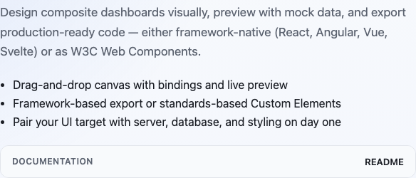

# The Builder: The Dashboard Component Factory

RosettaDash’s builder is an Angular client using a NestJS API, both local. From the repo root:

```bash
npm install
npm start
```

Open <http://localhost:4200>. You need both processes. Save, preview, and export talk to the API. There is no required cloud. The machine in front of you is the environment.

## Getting Started

You select a front end framework, which determines future choices of servers, database, and styling suggestions. Certain libraries and applications favor or are only available to specific frameworks, such as Nuxt, mui, and others. The secondary selections change when you change base framework.

After you have selected Web Components, React, Angular, Vue, or Svelte, choose the mix of server and database (if any) along with how you will style the components, then press Continue to builder.

If you have a small screen, you will immediately see an alert saying that you need a screen with of 1024 pixel or greater. Truthfully, the builder is more suited for large desktop screens, at least 1280 or more pixels.

## Becoming Familiar with the Interface

The sections of the interface are: the components are grouped on the left side of the screen in a palette. Next is the canvas, where components are placed by selecting the + button on their component. Once on the canvas, their details are available in the Inspector panel on the right. At the top of the screen, choices like design and preview, undo and redo, select and apply template, create, how it works, AI assist and export, and save and save to library provide the ways to see and work with the components, and how to create, export and save the components that you have created.



**Components.** On the left side, the components are arranged in groups. You will recognize many: a KPI, a table, a date range, a grid, a chart. There are many more that you will not need for the first composite. Clicking the components header collapses it to the left side.

**Canvas.** In the center of the app, you can place, snap, resize, and multi-select in the canvas. The canvas is for the positioning and sizing of the component elements for your exported component.


**Inspector.** On the right side, the Inspector is activated when something is selected on the canvas. Properties, suggestions, data sources and other details are visible here.

**Preview.** Switch to Preview. Mock data comes from the local API. Click the filter. Watch the table.


**Export.** Full composite, a single node, or a selection neighborhood (the pieces you highlighted plus what they need). Download source. For a UI-only stack you get templates, styles, and scripts.


## Nodes that never render

Not everything on the canvas is a widget.

You can drop infrastructure: an env map, a database, a server target. They do not draw a card. They generate config, stubs, and `.env` templates when you export. Connection strings stay in env vars. They are not hard-coded in the zip.

## Composite components

A **composite component** is a group of components that work as a unit. You can save it, version it, export it as a page or a module. The weather widget in `demos/` is that idea at card scale. Destination Atlas, later in this series, is the same idea at app scale.

## Next

The next article is Storybook: same pieces, isolated, before they have to are part of a product. Do not open Destination Atlas yet. Learn one component on a catalog page first. If you want a composite that already left, `demos/` has eleven of those. They are the export, not the shop floor.
