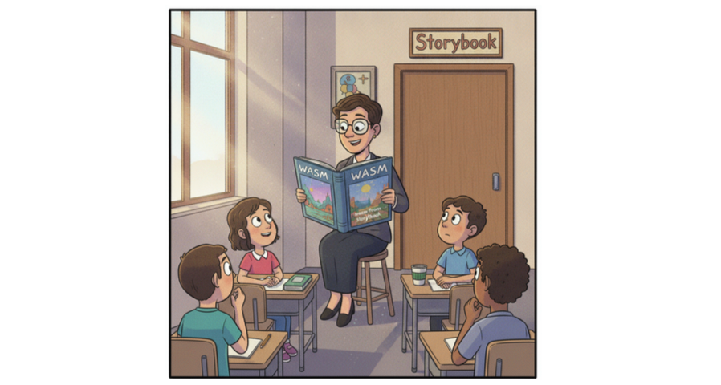
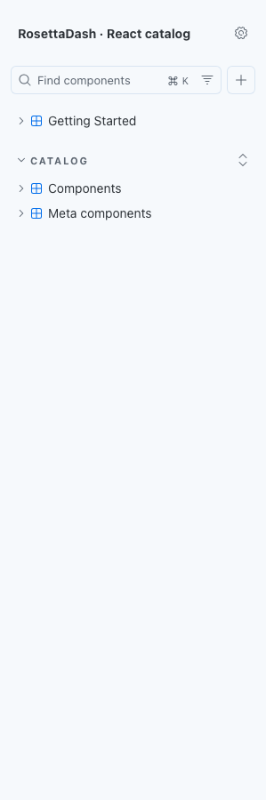
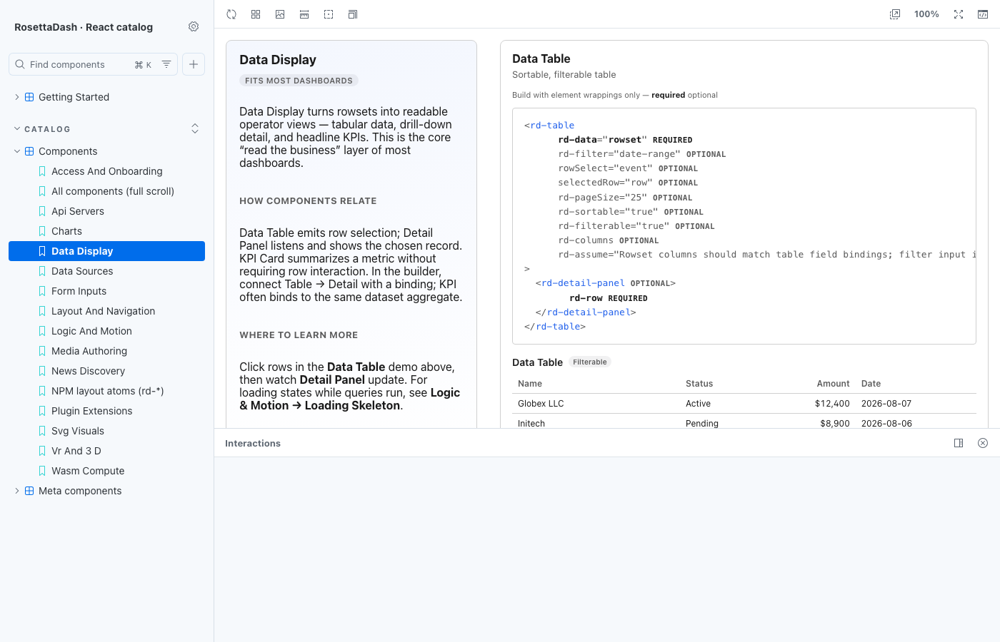
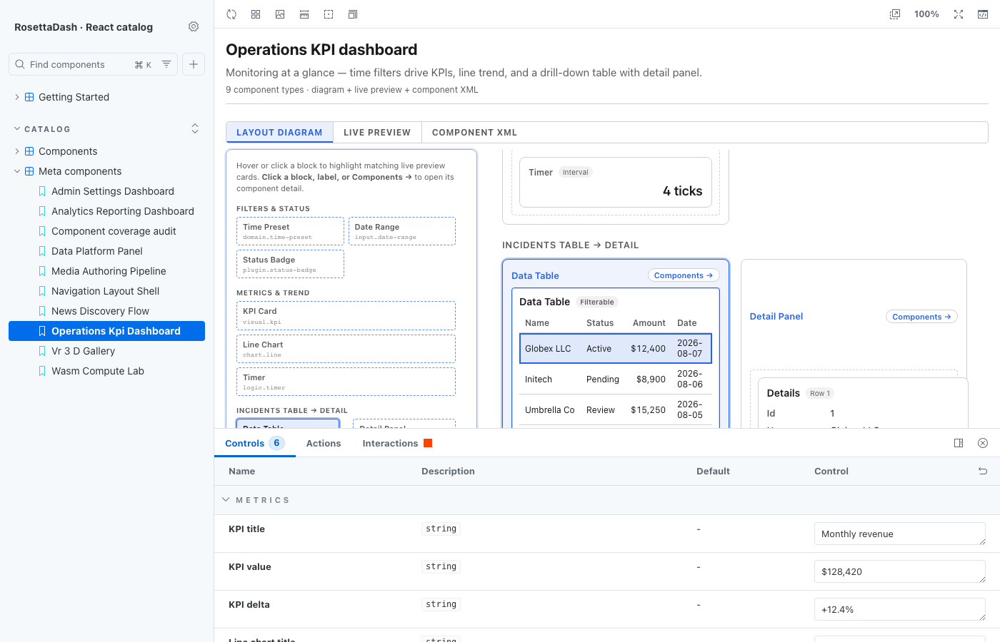

# Storybook: Making Sense of the Pieces



Storybook simplifies. It lets people know how to work with shared assets. RosettaDash ships with five Storybook catalogs, one for each framework. The ports are 6006 (Web Components), 6007 (React), 6008 (Vue), 6009 (Angular), 6010 (Svelte). The header says `RosettaDash · {runtime} catalog`.

Example:

```bash
npm run storybook:react
```

Open <http://localhost:6007>. You land on **Getting Started → Start here**.

## The sidebar

**Getting Started** has three pages: the map of the catalog, a component count, and styling modes.



**Catalog / Components** is one story per builder group, plus an all-components scroll, plus the npm `rd-*` layout atoms. The previews use the same visual language as the builder’s preview panel.



**Catalog / Meta components** are made up of multiple components. These dashboard recipes provide a preview of the Dashboard Atlas, which is created using all of the components.

The Meta sidebar has **nine dashboard recipes** (operations KPI, analytics,
admin settings, news, media authoring, WASM lab, VR/3D gallery, data platform,
navigation shell), a **Component coverage audit**, and **Full-stack orders
(live API)** — UI → generated server → seeded PostgreSQL `orders`.

Open **Catalog → Meta components → Full-stack orders (live API)** in React
Storybook (port 6007) or Angular Storybook (port 6009). One command boots
Docker DBs, generates server apps, starts parity containers, and opens
Storybook. Be sure to have Docker open if you are testing parity code.

```bash
npm run parity:stack:storybook:react
# or: npm run parity:stack:storybook:angular
```

React Storybook proxies to the Next.js container (:53103); Angular
Storybook to Nest (:53101).

The Meta sidebar also has **Full-stack news (live API)** — news
discovery UI → RosettaDash builder `GET /api/news` → Google News RSS
ingest with about a 24-hour cache. Destination-scoped lookup uses the
active destination id (default demo: Tokyo).

Open **Catalog → Meta components → Full-stack news (live API)** in any
runtime Storybook. One command starts the builder API and Storybook:

```bash
npm run storybook:react:live
# ports: builder :3000/api, Storybook :6007 (swap runtime as needed)
```

Storybook dev proxy maps `/builder-api` → builder `:3000`. A green
status line and a headline table mean live RSS is flowing. If the
builder is down, Destination Atlas and this story fall back to cached
travel headlines with real publisher URLs — not placeholder links.

The static **News discovery flow** recipe above still uses mock rows
for layout and Controls. **Full-stack news** is the end-to-end proof.



## Styling, briefly

Getting Started includes **Styling modes**: minimal, tokens, themed. That is how a consumer decides whether they are taking `--rd-*` tokens, the `.rd-*` classes, or fitting the pieces next to Tailwind, CSS Modules, or MUI. The stack styling guides in the repo go further.

## Next

Destination Atlas ties the pieces together in a functioning working application for each target frameworks.
