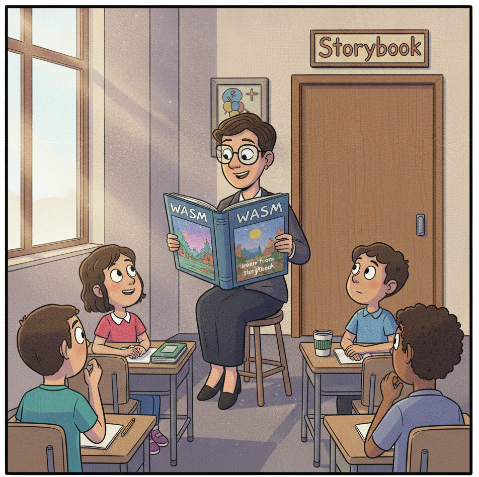

# Storybook: Making Sense of the Pieces



Storybook simplifies. It lets people know how to work with shared assets. RosettaDash ships with five Storybook catalogs, one for each framework. The ports are 6006 (Web Components), 6007 (React), 6008 (Vue), 6009 (Angular), 6010 (Svelte). The header says `RosettaDash · {runtime} catalog`.

Example:

```bash
npm run storybook:react
```

Open <http://localhost:6007>. You land on **Getting Started → Start here**.

## The sidebar

**Getting Started** has three pages: the map of the catalog, a component count, and styling modes.


**Catalog / Components** is one story per builder group, plus an all-components scroll, plus the npm `rd-*` layout atoms. The previews use the same visual language as the builder’s preview panel.


**Catalog / Meta components** are made up of multiple components. These ten recipes provide a preview of the Dashboard Atlas, which is created using all of the components.


## Styling, briefly

Getting Started includes **Styling modes**: minimal, tokens, themed. That is how a consumer decides whether they are taking `--rd-*` tokens, the `.rd-*` classes, or fitting the pieces next to Tailwind, CSS Modules, or MUI. The stack styling guides in the repo go further.

## Next

Destination Atlas ties the pieces together in a functioning working application for each target frameworks.
