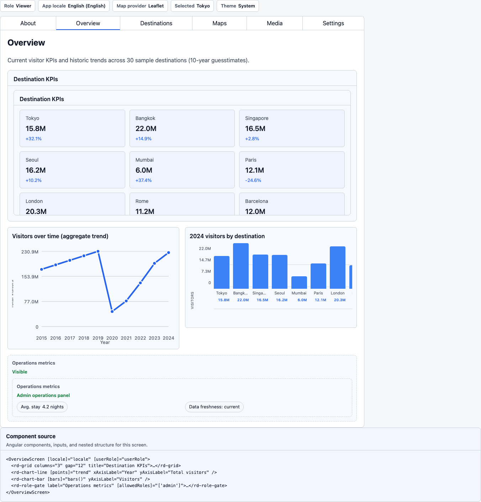
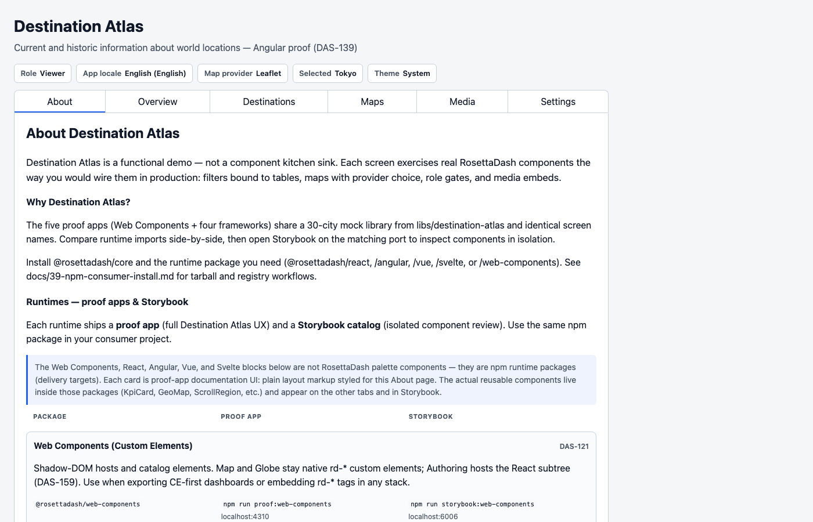
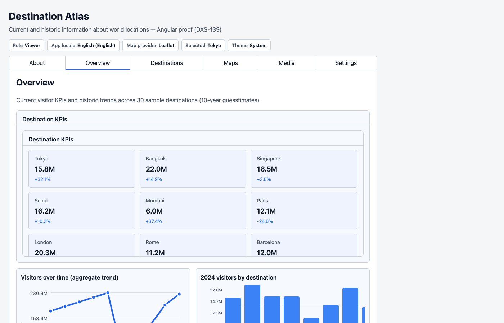
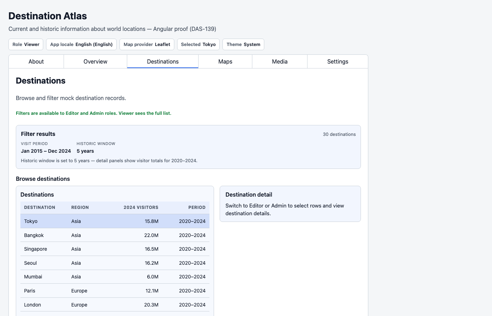

# Destination Atlas: Components in a Product

Storybook proves a single component in isolation. Destination Atlas
proves the pieces working together as a product.

Destination Atlas is current and historic information about world
locations: thirty cities, five per inhabited continent, with visitor
estimates from 2015 through 2024. You browse places, look at trends,
open a map, watch a video, and plan access. The app is a functional
demo built around explorer workflows. Page-embed widgets under
`demos/` do one job at card scale. Destination Atlas is a full
product.

Five proof apps share one library, `libs/destination-atlas`, and the
same screen names. This article uses the Angular proof:

```bash
npm run proof:angular
```

Open <http://localhost:4312>. The other runtimes follow the same
screens.

## Why a travel app

Most dashboard demos clone analytics: KPIs, a table, a line chart, a
date range. That set appears in Destination Atlas too. A place
explorer also requires work those clones skip: a map with more than
one engine, a globe, media you watch versus media you extract, roles,
locale, API keys, and infrastructure you can inspect.

Each component earns its place on a screen because the explorer
needed it.

## The workbench

Every tab except About is a two-pane workbench. On the left is the
Atlas preview. On the right is **Component source** — the template
and class for that screen: imports, props, and nesting.
On a narrow viewport, you toggle the panes rather than viewing them
side by side.

About is the only page-level scroller. The shell locks the body. The
other tabs are meant to fit the viewport.

The workbench layout appears again in the Maps and Settings articles.



## Three screens that establish the product

**About.** Why the demo exists, and a matrix of the five runtimes:
package, proof command, and Storybook port. The current row is marked
“You are here.”



**Overview.** KPIs, a line chart, a bar chart, chips, badges, and a
grid. This is the dashboard shape most teams already know how to
request. The factory has to deliver this screen before the rest of
the app counts.



**Destinations.** Search, region filter, a date range, time presets, a
table, and a detail panel. Filter to table to detail is the composite
from the builder article, now backed by a thirty-city library.
Selecting a row gives the rest of the app a selected place.



Those three screens are the focus of this article, on one runtime.

## The remaining tabs

The other tabs are named here and covered in later articles.

**Maps** — 2D providers and a 3D globe. **Media** and **Authoring**
— watch versus extract. **Plan** — roles and invites. **Stack** and
**Settings** — locale, keys, and invisible infrastructure.

Map engine switching and the authoring sphere are left for articles
5 and 6.

## Next

Destination Atlas is a product: a shared city list that other
screens can use. The next articles cover the pages where most
component libraries struggle — maps, globes, media, and a local
extract pipeline.
