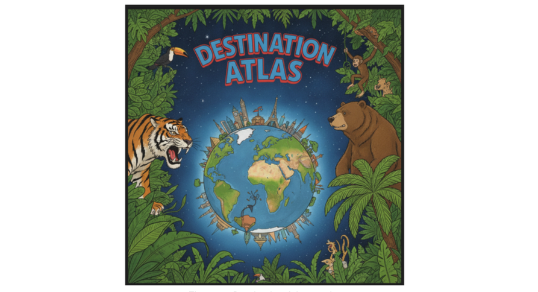

# Destination Atlas: Components working together

Destination Atlas provides information about thirty cities, five per inhabited continent, using every component in RosettaDash at least once. You browse places, look at trends, open a map, watch a video, and more. The app is a functional demo built around component workflows.



Five proof apps share one Destination Atlas library and the same screen names. This article uses the Angular proof:

```bash
npm run proof:angular
```

Open <http://localhost:4312>. The other runtimes follow the same screens.

## The workbench

Every tab except About is a two-pane workbench. On the left is the Atlas preview. On the right is **Component source** — the template and class for that screen: imports, props, and nesting. On a narrow viewport, you toggle the panes rather than viewing them side by side.

About is the only page-level scroller. The shell locks the body. The other tabs are meant to fit the viewport.

The workbench layout appears again in the Maps and Settings articles.


## About, Overview, and Destinations

**About.** Why the demo exists, and a matrix of the five runtimes: package, proof command, and Storybook port. The current row is marked “You are here.”


**Overview.** KPIs, a line chart, a bar chart, chips, badges, and a grid. This may be the dashboard shape most teams recognize.


**Destinations.** Search, region filter, a date range, time presets, a
table, and a detail panel. Filter to table to detail is the composite
from the builder article, now backed by a thirty-city library.
Selecting a row gives the rest of the app a selected place.


Those three screens are the focus of this article, on one runtime.

## The remaining tabs

The other tabs are named here and covered in later articles. Important to remember is that these merely demonstrate functionality. You can use the code freely on your own projects as you please, which means taking over the look and feel.

**Maps**: presented in 2D maps and a 3D globe, data-bound to the current destination;
**Media** is a simple YouTube player, playing videos of the current destination;
**Authoring** lets you select 360 media and create a video from a rectangular portion of it;
**Plan** (Admin) — for planning a trip, create details, team members, assign roles;
**Stack** (Admin) shows export-wizard infra nodes. On the React and Angular proofs, when Docker is running, it also loads live seeded `orders` rows from a generated API — the walkthrough is in article 6.
**Settings** — does what Settings ususally does: it is the place where roles, BYOK, providers, and all the header states are set.
**News** — destination-scoped travel headlines from Google News RSS via
the builder API (~24h cache).

Optional graphic after Destinations: capture the News tab with a
destination selected (`graphics/05-news.png`). React proof on :4311 is
a good default.

## Next

The next article deals with moving elements: 2D and 3D maps, 2D and 3D videos, and extracting media with JavaScript.
