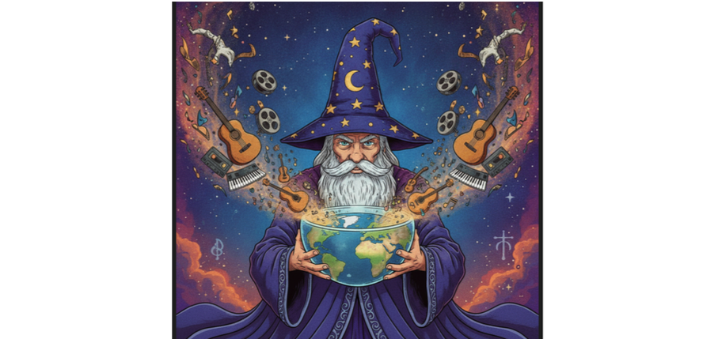

# Maps, Globes, Media, and WASM



Article 4 stayed on familiar ground: About, Overview, Destinations.
This article goes deeper into geo and media, where screens come alive, and it has two parts: maps and globes, then working with media.

This article uses the Vue proof:

```bash
npm run proof:vue
```

Open <http://localhost:4313>.

## Part A — Maps and globes

The Maps tab is one screen with two panels. You stay on the tab to switch from 2D to the globe.

**2D.** `visual.display.geo-map` takes a `provider`: `maplibre`,
`leaflet`, or `google-maps`. Same contract otherwise: center, zoom,
markers, `selected-id`, `marker-select`. Leaflet is a reasonable
default — light, raster-first, no key required if you accept OSM’s
limits. MapLibre wants vector tiles and often a MapTiler (or similar)
key. Google is paid after a free tier, strong at geocoding, and
comes with branding and ToS.

When you offer maps to users, costs can incur rapidly. Depending on the nature of the project, the Leaflet default may be all you require. In the next article, BYOK will be introduced for maps and AI assistance.

**3D.** `visual.display.3d-geo-globe` is a Three.js host: a texture and a marker rowset. Same thirty-city library. A pin click selects the place on the near side of the sphere. Then you can flip back to 2D and keep the selection.

The app is integrated to the point that if you choose a different city on the map, globe, destinations, media, or settings, you will see the update in the header as the Selected destination.


## Part B — Media and WASM

**Media** The simple YouTube video with metadata panel. Changing the destination in the pulldown will update the video and header. This is nothing but a YouTube player for each of the frameworks.

**Authoring** This is probably the most exciting component of the group. In this, you select a 360 image or video, which will be run within a three.js sphere that can be manipulated--zoom, rotate--as you can with any other. First, you must either choose a destination from the pull down menu, or click on the component to find one locally. Then, you position the rectangle, and stretch it by selecting its corners, and the screen on the right shows you what the exported video will look like.

You usually will reverse the video content, as the text appears backwards when you are inside a sphere. You can save the exported content as WebM or MP4.

The magic involved here consists of ffmpeg running on a server that is hosted within a Web Assembly (WASM) container in conjunction with client-side JavaScript and its image editing abilities. This component allows you to export whatever aspect ratio you choose, and you can select values directly, or with user controls, such as pinching and using multiple fingers.


The **360 tour demo** (`npm run demo:tour`, port 4330) is the
watch-side cousin: same library clips on
`rd-equirect-sphere-viewport` (Three.js interior sphere), without
the Authoring extract pipeline.

## Next

Now that the fun stuff is behind us, next is the important pieces in the mix that are often overlooked: keys, roles, locale, and the invisible stack.
