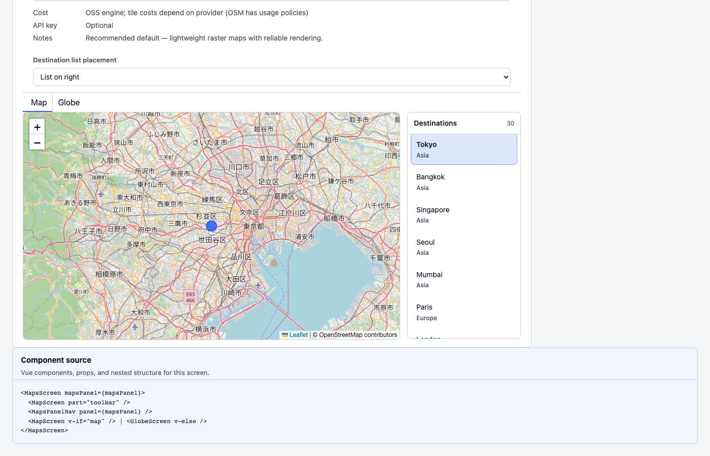
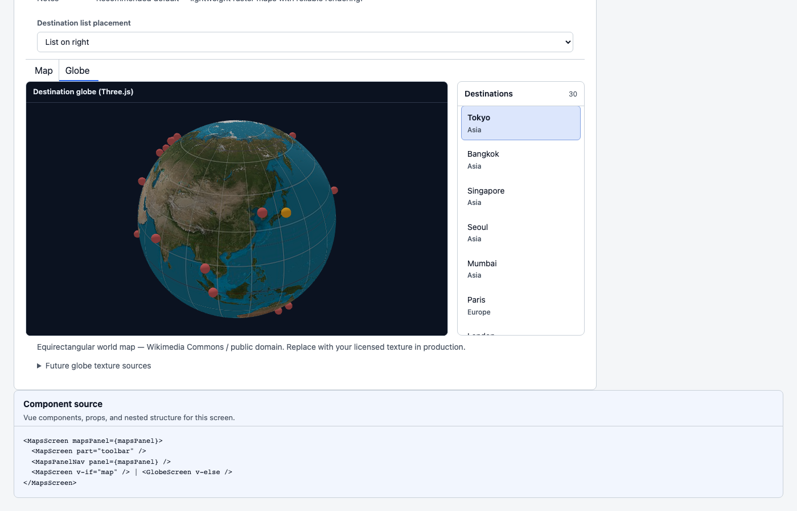
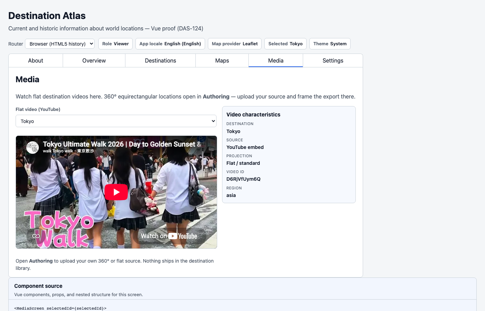
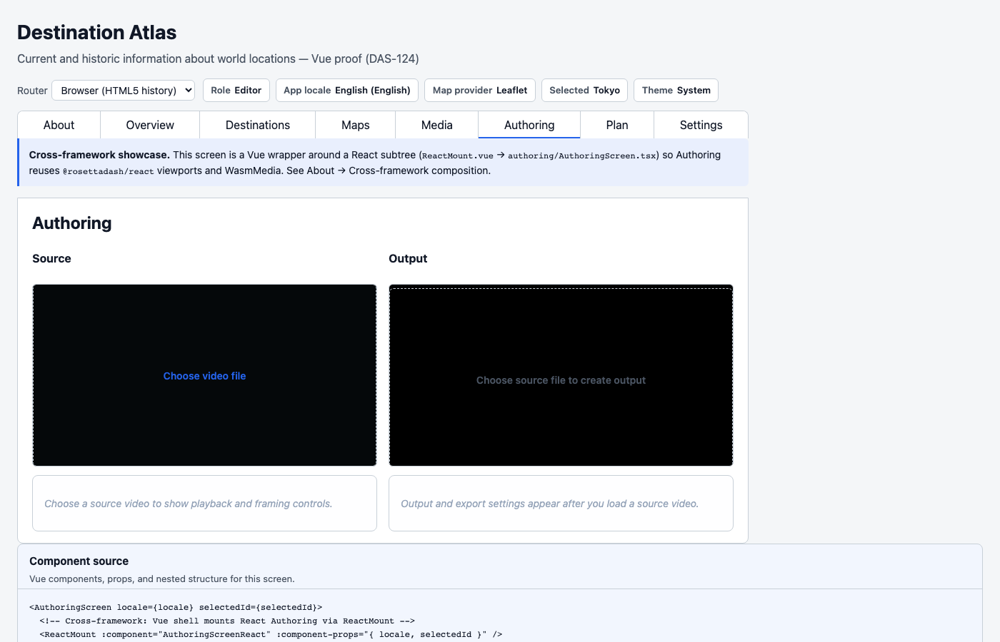

# Maps, Globes, Media, and WASM

Article 4 stayed on familiar ground: About, Overview, Destinations.
This piece goes deeper into geo and media — the screens where
component libraries usually struggle.

The article has two parts: maps and globes, then watch and extract.
This article uses the Vue proof:

```bash
npm run proof:vue
```

Open <http://localhost:4313>.

## Part A — Maps and globes

The Maps tab is one screen with two panels. You stay on the tab to
switch from 2D to the globe.

**2D.** `visual.display.geo-map` takes a `provider`: `maplibre`,
`leaflet`, or `google-maps`. Same contract otherwise: center, zoom,
markers, `selected-id`, `marker-select`. Leaflet is a reasonable
default — light, raster-first, no key required if you accept OSM’s
limits. MapLibre wants vector tiles and often a MapTiler (or similar)
key. Google is paid after a free tier, strong at geocoding, and
comes with branding and ToS. RosettaDash documents those tradeoffs.
The consumer picks a provider.

The destination list stays in lockstep with the map. Pick a city; the
map follows. Click a marker; that city is selected.

**3D.** `visual.display.3d-geo-globe` is a Three.js host: a texture
and a marker rowset. Same thirty-city library. A pin click selects
the place on the near side of the sphere. Then you can flip back to
2D and keep the selection.

Provider choice is a product decision. One component, three engines,
one event.





## Part B — Watch versus extract

**Media is watch.** Flat YouTube embeds and a metadata panel.
YouTube’s ToS and ads apply. For 360° destinations, Media links to
Authoring.

**Authoring is extract.** You upload your own source. The pane
auto-detects flat versus roughly 2:1 equirect.

- Flat: a crop rectangle and a live output mirror.
- 360°: an interior sphere, orbit, Shift+drag framing, a little-planet blend at wide FOV.

The playback bar is play, pause, stop, record. An orange segment is
the trim range the extract will use. Output: presets, custom width
and height, reverse, then ffmpeg.wasm and a download.

The ffmpeg core is served same-origin. The proof sets COOP and a COEP
mode that lets SharedArrayBuffer work while YouTube keeps playing on
the other tab. Editor and Admin only; who can open Authoring is a
role story for the next article.

Watch and extract are separate jobs, so they get separate pages.

This article stops at extract-in-the-browser.






The 360 tour demo (`npm run demo:tour`) is the watch-side cousin: a
custom-element player on a host page, separate from the Authoring
extract pipeline.

## Next

Spatial and media are real screens now. Next is the half most demos
skip: keys, roles, locale, and the invisible stack.
