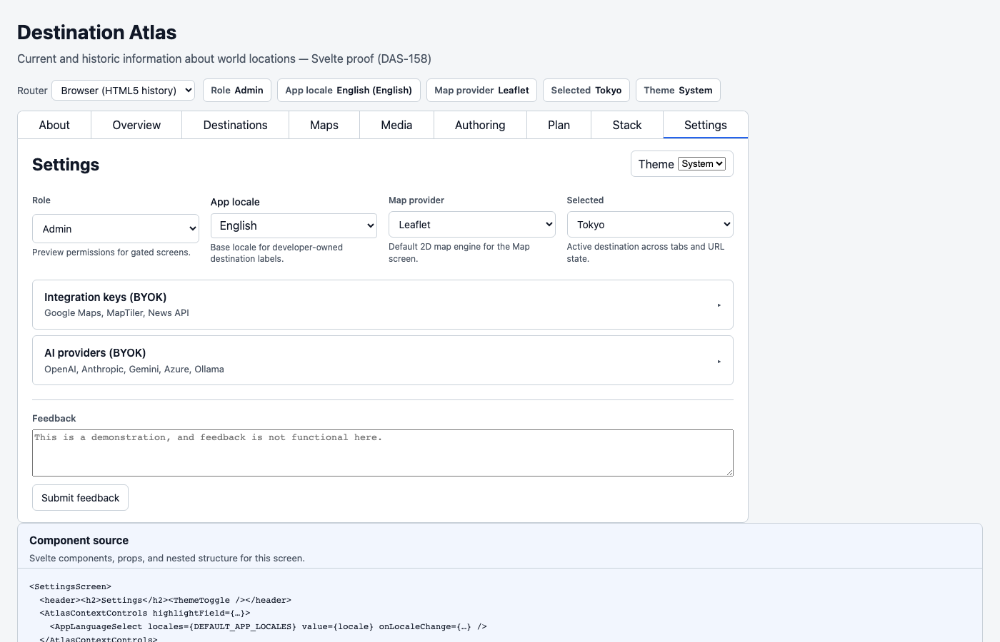
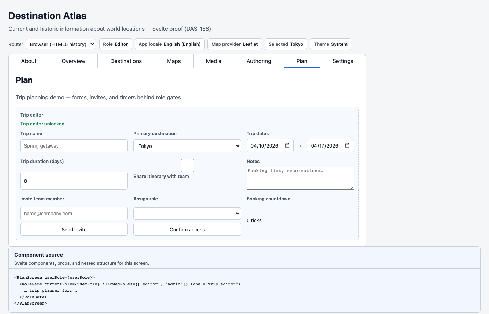
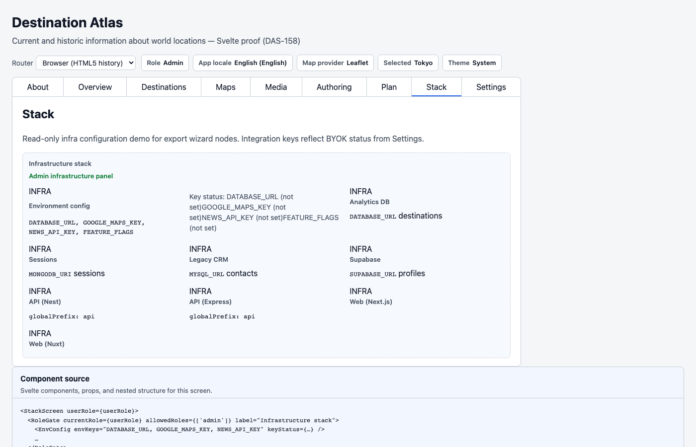
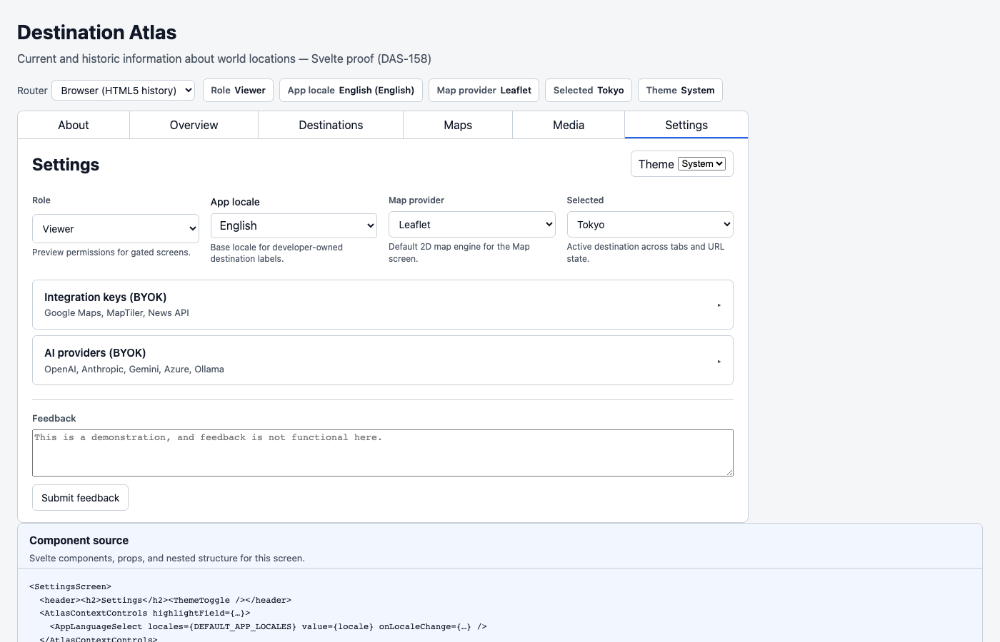

# Settings including BYOK, Roles, i18n, Stack, and Details

As an app developer, we regularly revisit the same behind-the-scenes challenges. Things such as connecting keys and authenticatiom, enabling views based on roles, ensuring that each language target gets what they asked for, and other minutia.

For this view, we will use the svelte app.

```bash
npm run proof:svelte
```

Open <http://localhost:4314>.

## Settings — locale, keys, details

**App locale.** `domain.i18n.app-language-select` sets a base app
language using standard locale codes (`en`, `es`, `fr`, `de`, `ja` in
this proof) and emits `locale-change`. You wire that to your own i18n — svelte-i18n,
vue-i18n, react-intl, ngx-translate, whatever you already use.

**Keys stay in the browser.** Two Admin collapsibles: **Integration keys** and **AI providers** — both bring-your-own-key (BYOK) vaults. Maps can use Google or MapTiler. AI is OpenAI, Anthropic, Gemini, Azure, Ollama — all on the same Settings page. The vault is encrypted in this browser. Nothing goes to a RosettaDash server. Map reads a stored key when one exists; otherwise it falls back to what the proof ships in env. Viewer and Editor can see that the vault exists. Only Admin can write it.



## Plan — roles

Only Editor and Admin have access to the Plan tab. This is the roles gate in action. Here, if you have permissions, you can invite a person, assign a role, name the trip, pick a city, set dates, duration, travelers, and keep notes.  Users without permissions (i.e., viewers) are rerouted to the About landing page.



## Stack — invisible infrastructure

Stack is Admin only. A read-only grid of the infra nodes from the builder article: env keys, Postgres, Mongo, MySQL, Supabase, Nest, Express, Next, Nuxt. Choosing a server or a database in the builder generates stubs and `.env` templates. Connection strings stay in env vars, not in the exported source.





## Next

The final article ties it all together and digs into how one canvas was used to generate five runtimes, with one of them
mixing frameworks on purpose.
