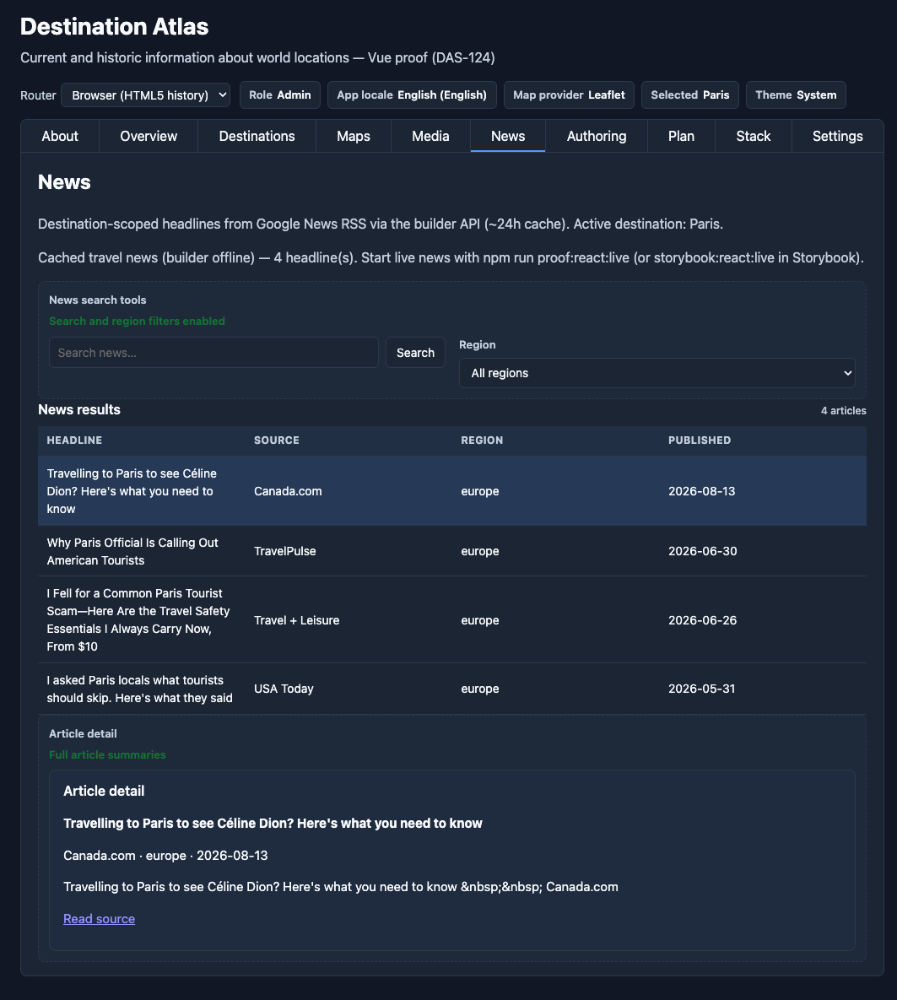

# News and Settings including BYOK, Roles, i18n, Stack, and Details


The ideas for setting up a newsfeed or choosing which settings are important or desired for you to set in your app are your own. Changing source and destination on any example or component will make it yours and useful for your projects. For Destination Atlas, we wanted a newsfeed relevant to the selected destination. We wanted to expose enough of BYOK inclusion to inspire thought for how it could apply to your needs.

## News

The headlines follow the **selected destination** from Destinations, Map, Globe, or Media; with the same city id as the header.

**Viewer** sees the results table only. Click a headline to open the publisher article in a new browser tab.

**Editor** and **Admin** also get search and region filters, plus an **Article detail** panel with summary and a **Read source** link. Admin refreshes the RSS cache under Settings — article 6.

**Try it locally:**

```bash
npm run proof:react:live
# builder API :3000/api + React proof :4311 — swap runtime as needed
```

Open the **News** tab. Pick a destination on **Destinations** or **Settings** to change the selection. With the builder up you get live RSS; when it is offline the app shows cached travel headlines instead of failing.



## Settings

As an app developer, we regularly revisit the same behind-the-scenes challenges. Things such as connecting keys and authenticatiom, enabling views based on roles, ensuring that each language target gets what they asked for, and other minutia.

For this view, we will use the svelte app.

```bash
npm run proof:svelte
```

Open <http://localhost:4314>.

### role, locale, keys, details

**role** The first setting to choose is the role. Viewer, Admin and Editor roles have different views and accesses to content.

**App locale.** `domain.i18n.app-language-select` sets a base app
language using standard locale codes (`en`, `es`, `fr`, `de`, `ja` in
this proof) and emits `locale-change`. You wire that to your own i18n — svelte-i18n,
vue-i18n, react-intl, ngx-translate, whatever you already use.

**Keys stay in the browser.** Two Admin collapsibles: **Integration keys** and **AI providers** — both bring-your-own-key (BYOK) vaults. Maps can use Google or MapTiler. AI is OpenAI, Anthropic, Gemini, Azure, Ollama — all on the same Settings page. The vault is encrypted in this browser. Nothing goes to a RosettaDash server. Map reads a stored key when one exists; otherwise it falls back to what the proof ships in env. Viewer and Editor can see that the vault exists. Only Admin can write it.

**News feeds (admin).** A third Admin collapsible on Settings — next to
Integration keys and AI providers. Only **Admin** can refresh the
builder’s Google News RSS cache (~24 hours). Viewer and Editor see the
gate message; they browse headlines on the **News** tab without admin
tools.

The panel shows article count, last fetch time, and configured feed
queries. **Refresh news cache** calls `POST /api/news/admin/refresh`
through the same `/builder-api` proxy the proof apps use.

**Try it locally:**

```bash
npm run proof:react:live
```

Open **Settings** as Admin (`?role=admin` in the URL). Expand **News
feeds (admin)** and refresh. Then open **News** with a destination
selected to see updated headlines.

React, Vue, Svelte, and Web Components proofs ship this panel. Angular
proof has the News tab but not the Settings admin block yet.


<!-- Optional fifth graphic: capture News feeds (admin) expanded as Admin. -->

## Plan — roles

Only Editor and Admin have access to the Plan tab. This is the roles gate in action. Here, if you have permissions, you can invite a person, assign a role, name the trip, pick a city, set dates, duration, travelers, and keep notes.  Users without permissions (i.e., viewers) are rerouted to the About landing page.


## Stack — invisible infrastructure

Stack is Admin only. A read-only grid of the infra nodes from the builder article: env keys, Postgres, Mongo, MySQL, Supabase, Nest, Express, Next, Nuxt. Choosing a server or a database in the builder generates stubs and `.env` templates. Connection strings stay in env vars, not in the exported source.

On the **React** and **Angular** proofs, the Stack tab can go one step
further: it loads seeded `orders` rows from a generated API backed by
PostgreSQL in Docker — the same path export gives you (UI → server →
database). The infra grid above still applies; the live table shows that
path working, not just the export-wizard labels.

**Try it locally** — one command prepares the parity stack and opens
the React proof (Angular uses Nest on :53101 instead of Next on :53103):

```bash
npm run parity:stack:proof:react
# or: npm run parity:stack:proof:angular
```

Open Stack as **Admin**. A green banner and a **Seeded orders** table
mean the export is serving rows. If Docker is not up, the tab explains
what to run instead of erroring out.

This article uses the **Svelte** proof (`npm run proof:svelte`, port 4314)
for Settings and Plan. Svelte Stack shows the infra grid only — use React
or Angular when you want the live orders demo. From the cloned repo root,
`parity:db:up` seeds four databases in Docker; `parity:generate` and
`parity:servers:up` boot generated Nest, Express, Next, and Nuxt apps that
serve the same `orders` rows the builder previews (ports 53101–53104).


## Next

The final article ties it all together and digs into how one canvas was used to generate five runtimes, with one of them
mixing frameworks on purpose.
