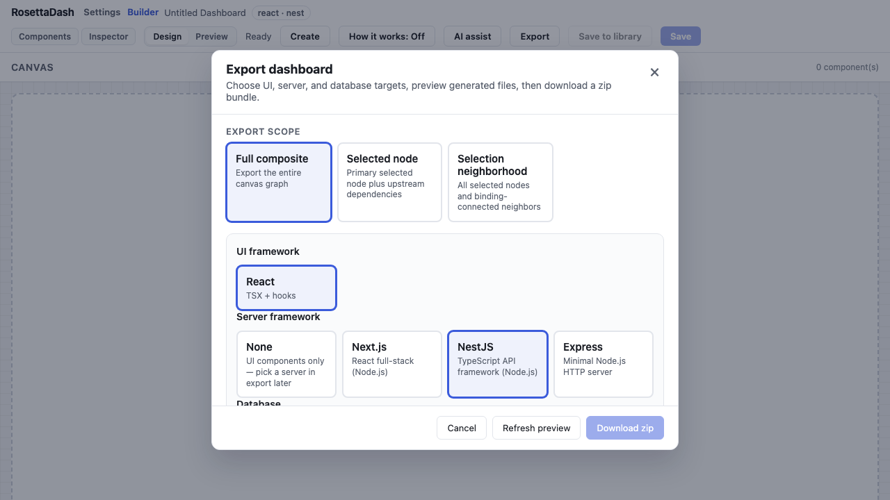
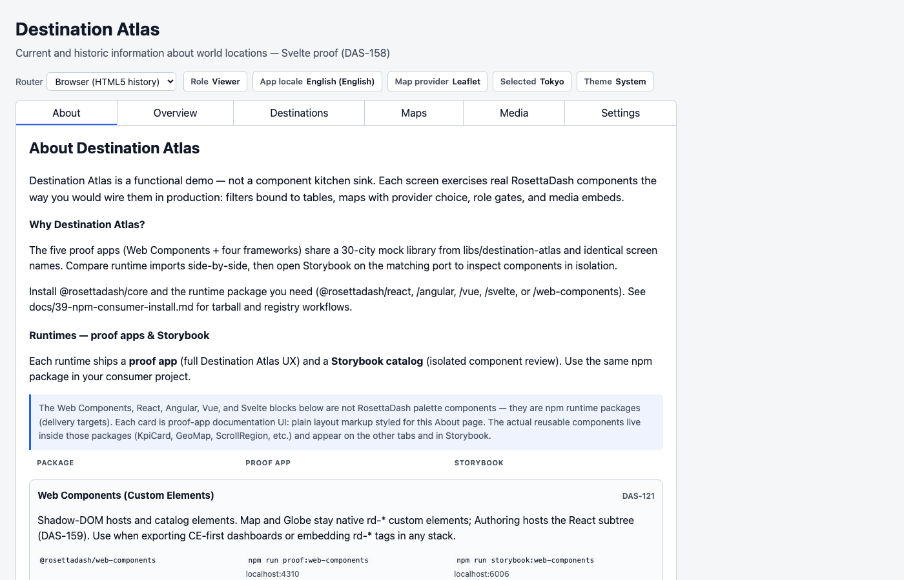
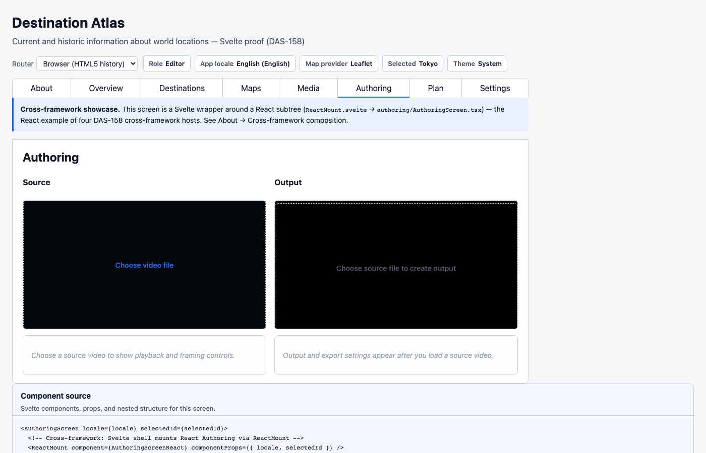
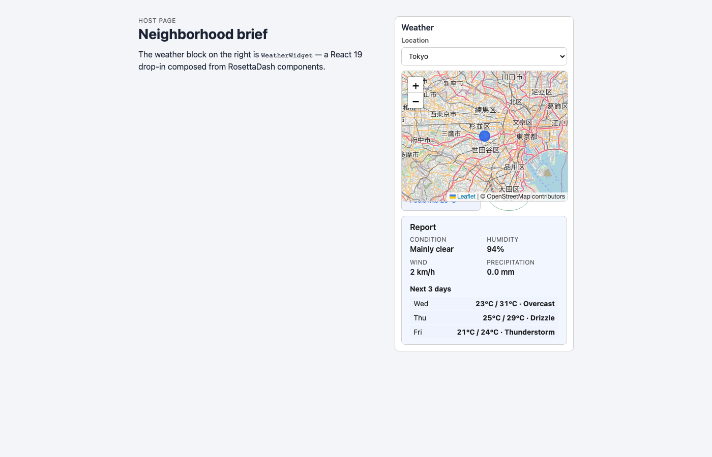

# One Canvas: Five Runtimes and Purposeful Mixing

Articles 4 through 6 each used one framework as the camera angle:
Angular, Vue, and Svelte. The product itself spans all five.

The builder is Angular. You compose on one canvas. When you export,
the same layout can leave as React, Angular, Vue, Svelte, or W3C
custom elements — you choose the target at export time; the canvas
does not change. Article 1 introduced that idea. This article
shows how it works in the repo: the five Destination Atlas proofs,
and the one proof that deliberately embeds another framework on
some screens.

Overview, Destinations, Maps, and Authoring already have their
articles.

## One foundation, five implementations

Compose on the canvas, fix validation errors, then export. Before
any framework-specific files are written, the builder turns your
graph into one validated description: which components you placed,
how they connect, which env vars and server choices apply, and
which UI target you picked. Every exporter reads that same
description. Adding another framework does not mean rebuilding the
builder — it means adding another exporter that understands the
same input.

The default download is standalone source. Drop the zip into a
project, set environment variables, and run. You do not need to
install `@rosettadash/*` to ship what you just exported. If you
prefer npm instead, install the packages for the framework you
already use and import a typed component — for example a key
performance indicator (KPI) card:

```bash
npm install @rosettadash/core @rosettadash/vue
# or: @rosettadash/react |
#     @rosettadash/angular |
#     @rosettadash/svelte |
#     @rosettadash/web-components
```

Everything runs on your machine. The generated files live in your
tree.



## Five proofs, one library

Destination Atlas ships five times — same thirty cities, same screen
names, one shared library at `libs/destination-atlas`.

| Runtime | Command | Port |
| --------- | --------- | ------ |
| Web Components | `npm run proof:web-components` | 4310 |
| React (reference UX) | `npm run proof:react` | 4311 |
| Angular | `npm run proof:angular` | 4312 |
| Vue | `npm run proof:vue` | 4313 |
| Svelte | `npm run proof:svelte` | 4314 |

Open **About** in any proof. The matrix lists Package, Proof app, and
Storybook; the current row is marked “You are here.” Article 4
introduced the matrix. Here the point is sameness: switch runtimes
and the product should feel like the same app.



**Vue** is Vue throughout — native single-file components, same tabs,
no embedded React or Angular on its screens.

**Web Components** stays on custom elements throughout — Map, Globe,
Media, and Authoring use `rd-*` tags, not a nested React or Vue
tree.

## Mixing on purpose

During a migration, teams often keep one screen on the stack that
already implements it instead of rewriting immediately.

Only the **Svelte** proof does that on purpose. Its shell hosts
three guests:

- **Globe** — the Vue Three.js wrapper around the geo globe.
- **Media** — the Angular YouTube embed component.
- **Map** — the `<rd-geo-map>` custom element via `svelte:element`.

Authoring is native Svelte — EquirectSphereViewport, FlatVideoViewport,
and WasmMedia from `@rosettadash/svelte` (DAS-179).

That is a realistic pattern: reuse what already works, wire it in
one app frame, and document the bridge. Storybook showed each piece
alone; Destination Atlas shows them together. If you capture a
screenshot for documentation, show both the Svelte host and what it
is embedding.



The smaller demos under `demos/` do the same at card scale: a React
host page, a Vue host page, a custom-element 360° tour. Same idea,
smaller frame.



## Close

Clone the repo. Run the proof for the framework you use day to day,
or run `npm start` and export a single KPI into a project you
already have. Storybook is still there when you want one component
in isolation.

You compose once. You choose where the source lands.
